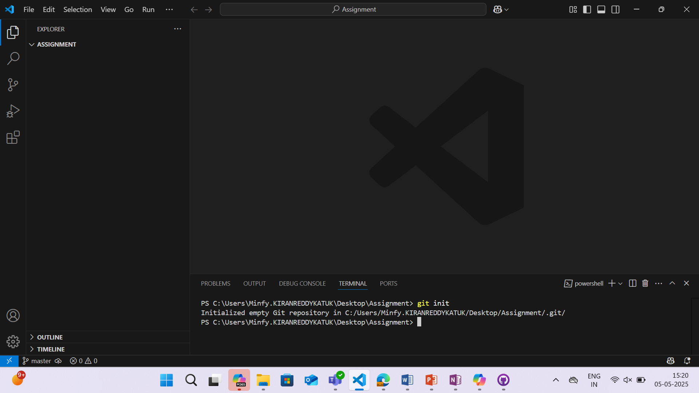
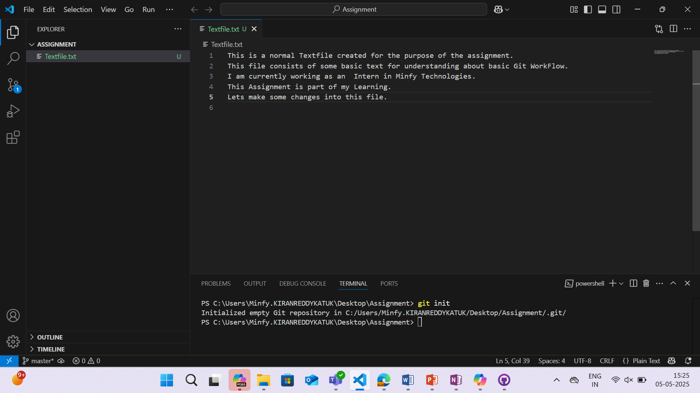
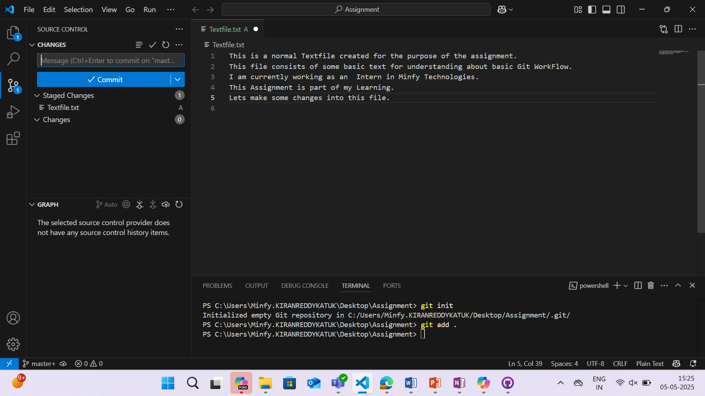
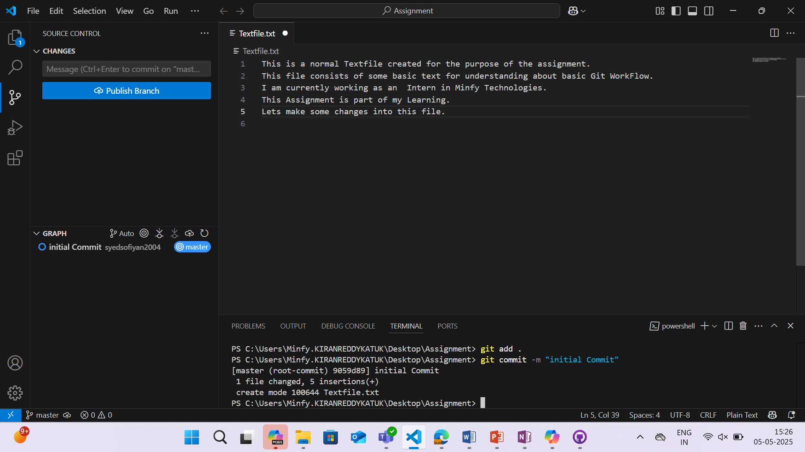
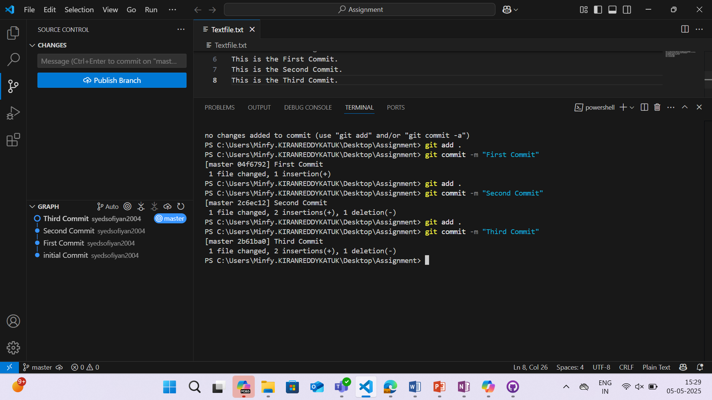
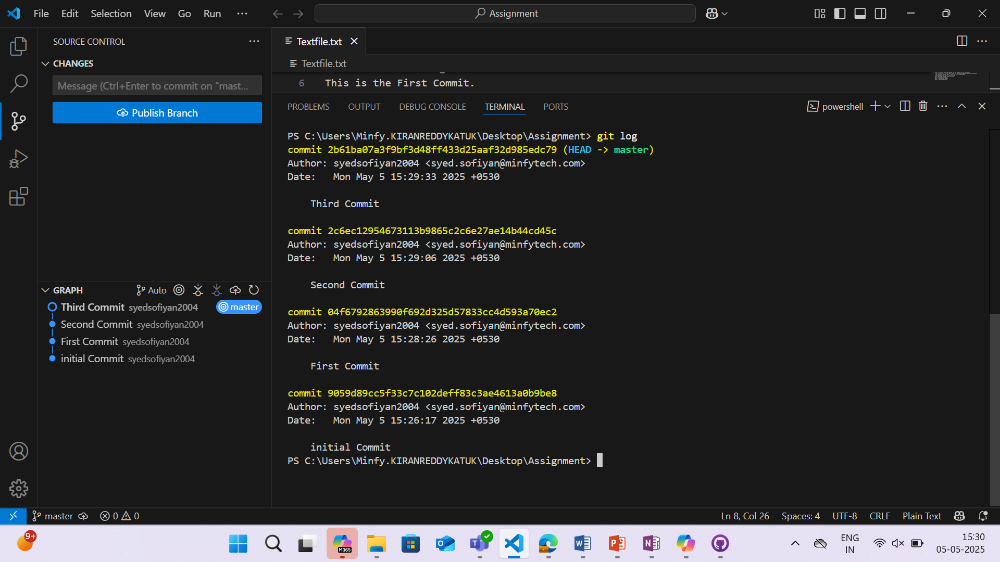
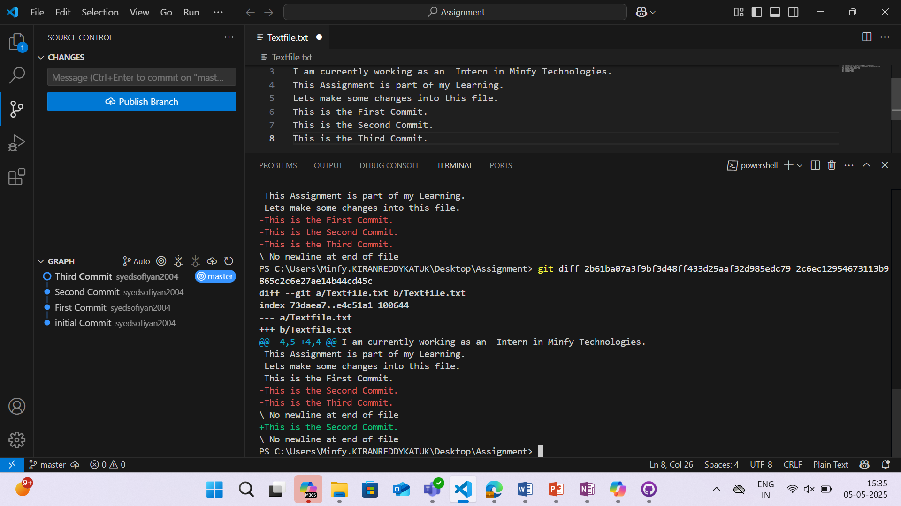

# **Assignment 1: Learn Fundamental Git Commands and Basic Workflow**

## **Objective**
This assignment is designed to help understand the **basic commands of Git** and their usage in a version-controlled environment.

## **Tasks**

### **1. Creating a Git Local Repository:**
To initialize a new Git repository, use the following command in **Git Bash** or **VS Code terminal**:

```sh
git init
```
Run this command inside the folder where you want to set up the repository. For this assignment, the folder is named "Assignment", so the command should be executed within it.
This will create a hidden .git directory in the folder, which can be viewed by enabling hidden files.


### 2. Creating a Simple Text File:
Create a new text file with 5–10 lines of content.


### 3. Adding the File to Staging and Making an Initial Commit:
We can stage the file using the following command:
```sh
git add .
```

This moves the changes into the staging area. To commit these staged changes, use the following command:
git commit -m "Initial Commit"

The commit message should be relevant to the change and always written in the present tense.

### 4. Make 3 separate meaningful changes to the file, committing each change with a proper commit message following Conventional Commits format:
Now here we can do three separate changes which involves commit for each change we can name them as First Second and Third commits lets do this:

 
as we can see in the image we have done 3 edits and then commit those changes 

### 5. Viewing the History of Changes
To view the history of commits, use the following command:
```sh
git log
```

This displays all commits with their details, including commit messages and hashes.

### 6. Examining Differences Between Commits
To compare changes between commits, use:
```sh
git diff HEAD~n
```
Alternatively, obtain commit IDs using git log and compare two commits:
```sh
git diff COMMIT_ID1 COMMIT_ID2
```
Green text indicates added lines, while red text indicates removed lines.


Successfully Completed Assignment 1.


